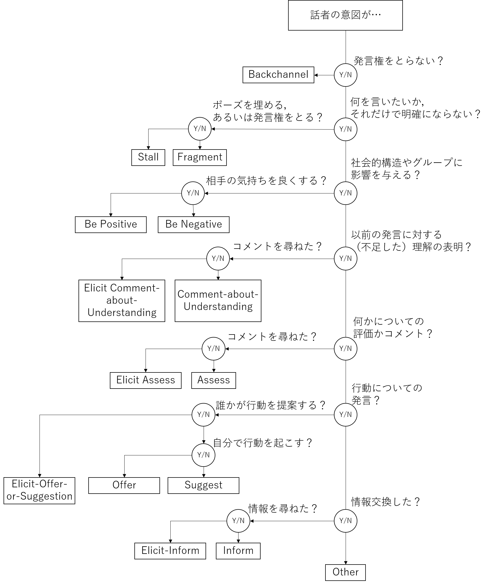

# ラベリングのヒント

1. ラベルを付けるときは，発話に新しい情報が含まれているかどうかを考えること．
1. また，「だから」，「なので」，「また」，「あるいは」などの接続詞や，新しい句を導入するときの長いポーズにも注意すること．これらは別の新しいラベルのヒントになりうる．
1. 発話の関係を考えること．例えば，「答え」は「質問」の後に続くことが多く，また「理由」は「質問」の後に続くことが多い．しかし質問に答えずに質問を返す場合もあるため，発言者の振舞いには注意を払うこと．

# あり得る混同
混同があり得るクラスについて，考えられるものを紹介します．

## `Fragment` versus `Stall`
`Fragment`と`Stall`は，それぞれがカバーする範囲で区別できる．

後に続く発言が同じ話者のものであり，かつその後続の発言が先行する発言と同じ意味を持つ，あるいは，同じ文体を持つか若干の言い換えである場合は，`Stall`とラベリングする．それ以外は`Fragment`である．

## `Fragment` versus `Other`
`Fragment`と`Other`は両者ともに，不要なものを入れておくバケツのようなものである．

`Fragment`は話者の意図を本当に伝えないものであり，適切な対話行為ではない発言のためのクラスである．

`Other`は話者の意図が伝えるものであり，適切な対話行為であるが，定義したクラスのいずれかにも当てはまらない発言のためのクラスである．

## Actions versus information exchange
possible actionsは歪曲的な表現が使われることもあり，その場合はinformation exchangeと同じ文体になってしまうことから，対話行為の判断を簡単に間違えてしまう．

その対話行為がinformation exchangeかactionsかを判断するためには，ある人やグループが行うことに関するすべてのことがactionsとしてカウントされることを把握しておくことが重要である．

例えば，リモコンのデザイン会議では，グループはリモコンの色を決めなければなりません．「リモコンの色は緑でしょう」は，会話グループに対してリモコンの色を緑にするように提案したことから，actionであり，特に`Suggestion`である．

その一方で「マーケティングレポートでチタンがトップになった」は単に情報を事実として述べているだけである．しかし話者がこの発言により，リモコンはチタンで作られるべきだという意図を持つことが明らかな場合，リモコンをチタンで作るというactionについての間接的な示唆になる．この区別は主観的なものだが，注意深く聞き取ることで話し手の意図を判断することができる．

## `SUGGEST` versus all types of elicitation
対話相手から何かを引き出す3つのラベル (`Elicit-Inform`, `Elicit Assessment`, `Elicit offer-or-suggestion`) は，ある意味ではすべて提案であり，会議の参加者が特定の意図を持って話すという行為を行うことを提案している．

他の種類の行為を示唆する発言は`SUGGEST`に分類することは控え，より具体的なELICITラベルを使用すべきことを留意すること．

## `STALL` versus reflexive `OFFER` to speak
話し手がまだ言いたいことの内容の準備ができていない場合，話者は`STALL`を使用するのではなく，何か言いたいことがあることを明示的に伝えることがある（例：「ちょっと待って，何か言いたいんだけど」など）．また，例えば，「自分が言いたいことが3つある」，とグループに伝えることで，通常よりも長い発言枠を前もって予約しようとすることもできる．

以上のような発言の効果は`STALL`とよく似ている．しかし`STALL`のカテゴリーに含まれる躊躇や再スタートとは性質が大きく異なり，話者が話したい内容とは別に，さらなる議論（スケジューリングについて）を引き起こす可能性がある．従って以上は，議論を乗り切るための他の提案と同じように，話すという行為を実行するための，緩和された`Offer`として扱われるべきである．

## "okay"や"yeah"，また類似の発言の例
日本人がokayやyeah等を発言することは稀ですが，参考まで．

"okay"は様々な文脈で生じることから，ラベリングが難しい．他の話者の話を遮ろうとせず，バックグラウンドで行われるなら`Backchannel`である．質問のように使われる場合（例「・・・，okay?」）は，`ELICIT-ASSESSMENT`である．情報を受け入れる場合は`ASSESS`である．特定の`Suggestion`に対する返答としてなら`Offer`である．あまり内容的ではない場合，話者が何を言うべきか考える間の`STALL`である．

どのラベルを振るかを決めるためには，1) その発言に対する他の人の発言，2) 発言の際のイントネーション，の両方を考慮に入れる必要がある．これは，"yeah"のような他の似たような発言でも共通である．

# 4つのeliciting

相手の発言を要求する`eliciting`について4つの異なるラベルを定義した．簡単な概要を以下に示す．

- `Elicit-Inform`（事実，情報）：発言者は**情報**を求める
    - セーラームーンとは何ですか？映画ですか？
    - 日本人の言う「大丈夫」とは，どういう意味ですか？
- `Elicit offer-or-suggestion`（今後）：発言者は**提案または申し出**を求める
    - こういうときはどうすればいいですか？
    - 何かお手伝いできることはありますか？
- `Elicit Assessment`（過去）：発言者は**以前の問題についてコメント**を求める
    - これについてどう思いますか？
    - 私たちが何か悪いことをしたと思いますか？
- `Elicit-Comment-About-Understanding`（非常に限定的）：発言者は対話相手に**確認したいと思わせる**ようにする
    - 信じられない？彼は夜の23:00まで働いているんだ．
    - 彼にはガールフレンドが2人いるんだって．1人じゃない，2人だ．

# 分類フロー

参考にどうぞ．

